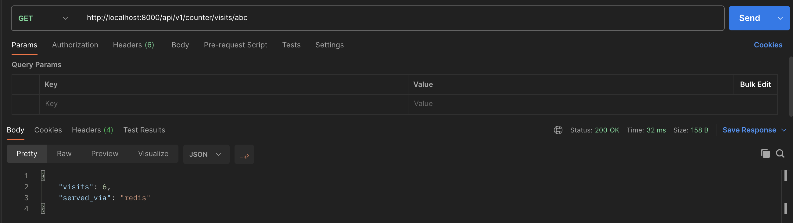

# Task 3: Implement Application Layer Caching

## Thought process behind selecting the best cache strategy
Since a visit counter involves frequent writes (increments) and frequent reads (displaying counts), choosing the right caching strategy is critical for balancing speed, accuracy, and consistency.

### 1. Read Strategy → Cache-Aside
✅ Why?
- Most requests will be reads, so caching avoids hitting the database frequently.
- If the cache misses, it fetches from the database and updates the cache.
- Gives flexibility in managing cache expiration.

✅ How to Implement?
- Read from cache (e.g., Redis)
- If cache miss → Fetch from DB and store in cache
- Set a TTL (Time to Live)

### Write Strategy → Write-Back or Batched Write-Through
Since the visit counter is write-heavy (incrementing counts frequently), direct database writes for every visit would be too expensive.

#### Option 1: Write-Back (Best for Performance)
✅ Why?
- Writes (increments) are done in the cache first, and updates to the DB happen asynchronously in batches.
- Reduces database writes, making it more scalable.
- Ideal if some small data loss is acceptable (e.g., losing a few visits if the cache crashes).

✅ How to Implement?
- Increment count in cache (e.g., Redis `INCR` command)
- Periodically flush updates to DB (e.g., every few seconds/minutes using a background job)

⚠️ `Risk`: If the cache crashes before flushing, some visit counts may be lost. To minimize this, increase the sync frequency.

#### Option 2: Batched Write-Through (For Stronger Consistency)
✅ Why?
- Still reduces DB writes by batching updates.
- No risk of data loss since every batch syncs to DB.

✅ How to Implement?
- Store visit count updates in cache
- Batch update the database periodically (e.g., every X seconds using a background worker)

⚠️ Risk: Slightly slower than Write-Back but ensures better consistency.

### Final Decision:
- For Task 3, we will use `Cache-Asides` for **reads** and `Write-Through` for **writes**.
- We will implement `Batched Write-Through` in Task 4.

#### Not-Present in Cache --> Served via Redis

#### Next-Time (with-in 5sec) --> Served via in-memory cache
 

### Testing Criteria:
- [X] Verify that the system reads from the cache instead of making redundant queries to Redis.
- [X] Ensure the cache expires after the TTL and retrieves updated values from Redis.
- [ ] Simulate high-frequency requests and ensure performance improves with caching.

### `Future Development`: Implement Eviction Strategies for Cache

# Pre-requisites
## Caching strategies
Caching strategies determine how data is written to and retrieved from the cache. The main types of caching strategies include:

### 1. Write Strategies
These define how data is written to the cache and the underlying storage.

#### a. Write-Through Cache
- **How it works**: Data is written to both the cache and the primary storage simultaneously.
- **Pros**: Ensures data consistency between cache and storage.
- **Cons**: Slower writes because every write operation affects both cache and storage.
- **Use case**: Critical applications where data integrity is more important than performance (e.g., database write operations).

#### b. Write-Back Cache
- **How it works**: Data is written to the cache first and later written to storage asynchronously.
- **Pros**: Faster writes, as it avoids immediate writes to storage.
- **Cons**: Risk of data loss if the cache fails before writing to storage.
- **Use case**: Performance-sensitive applications like gaming, databases with replication.

#### c. Write-Around Cache
- **How it works**: Data is written directly to storage, bypassing the cache.
- **Pros**: Avoids polluting the cache with infrequently used data.
- **Cons**: Subsequent reads may be slower since the cache doesn’t contain the newly written data.
- **Use case**: Systems with a high volume of write operations but low locality of reference.

### 2. Read Strategies
These define how data is read from the cache.

#### a. Cache-Aside (Lazy Loading)
- **How it works**: The application checks the cache first. If data is missing, it fetches from storage and loads it into the cache.
- **Pros**: Only frequently accessed data gets cached.
- **Cons**: First-time reads are slower.
- **Use case**: Database caching, API response caching.

#### b. Read-Through Cache
- **How it works**: The cache sits between the application and the storage. If a cache miss occurs, it automatically fetches data from storage.
- **Pros**: Simplifies caching logic for applications.
- **Cons**: Cache must always stay in sync with storage.
- **Use case**: CDN caching, database query caching.

#### c. Read-Around Cache
- **How it works**: Data is read directly from storage, bypassing the cache.
- **Pros**: Prevents unnecessary cache pollution.
- **Cons**: No performance benefits if the same data is requested multiple times.
- **Use case**: Rarely accessed or one-time-use data.

## Eviction Strategies
These determine how old data is removed from the cache when space is needed.
- **LRU (Least Recently Used)**: Removes the least recently accessed data.
- **LFU (Least Frequently Used)**: Removes the least frequently accessed data.
- **FIFO (First-In-First-Out)**: Removes the oldest data first.
- **Random Replacement**: Randomly removes cache entries.

## Read-Through vs. Cache-Aside: Which is Faster?
The speed comparison depends on various factors, but in general:
- ✅ Read-Through is faster for frequent cache misses.
- ✅ Cache-Aside is faster when the application manages caching efficiently and has high hit rates.

### 1. Read-Through Cache (Faster for Misses)
- The cache is tightly integrated with the backend storage.
- If data is not found in the cache, the cache automatically fetches it from storage.
- The application always queries the cache, reducing logic in the application.
- **Performance**: Faster for systems with many cache misses, as the cache layer directly handles data retrieval.
- **Use case**: CDN caching, database query caching (e.g., Redis as a read-through layer for MySQL).

### 2. Cache-Aside (Faster for High Hit Rates)
- The application manages the cache manually (reads from cache first, then fetches from storage on a miss).
- Requires explicit cache population logic by the application.
- **Performance**: Faster if the cache is well-tuned and has a high hit rate, since it avoids an extra middleware layer.
- **Use case**: Scenarios where the application has dynamic caching needs (e.g., API response caching).

### Which One Should You Choose?
- If cache misses are frequent → Read-Through is better (handles misses faster).
- If cache hit rates are high → Cache-Aside is better (avoids middleware overhead).

For a real-world example, CDNs use Read-Through, while databases (e.g., Redis + MySQL) often use Cache-Aside.

## Write-Through vs. Write-Back Cache: Speed & Consistency Comparison

### Speed Comparison
- **Write-Through** is slower because every write goes to both cache and storage immediately.
- **Write-Back** is faster because it only writes to the cache first and defers storage writes.

📌 If frequent writes are needed → Write-Back is preferred.
📌 If data integrity is crucial → Write-Through is preferred.

### Consistency Comparison
- **Write-Through** ensures consistency since storage is always up to date.
- **Write-Back** risks inconsistency because data exists in cache before syncing with storage.

📌 If strong consistency is needed → Write-Through is better.
📌 If performance is more important than immediate consistency → Write-Back is better.

### Conclusion: Which One to Use?
- **Use Write-Through** for **critical data** that must not be lost (e.g., financial transactions, logging systems).
- **Use Write-Back** for **high-speed applications** where some data loss is acceptable (e.g., caching in gaming, temporary user sessions).