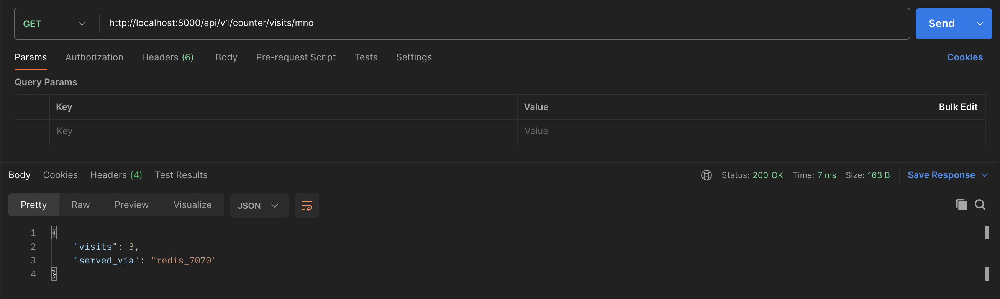
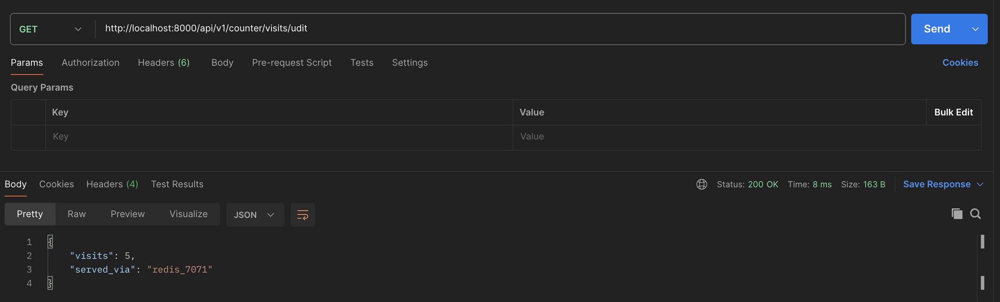

# Task 5: Implement Redis Sharding for Scalability

## APIs
### redis_7070


### redis_7071


## Implementation Consistent Hash
We are currently using two Redis instances:
```
In [3]: redis_nodes
Out[3]: ['redis://redis1:7070', 'redis://redis2:7071']
```
For each physical instance, we are creating 100 virtual nodes:
```
In [9]: consistent_hash.virtual_nodes
Out[9]: 100
```
Hence, we will have a total of 200 virtual nodes in our `hash ring`.
```
In [10]: consistent_hash.hash_ring
Out[10]: 
{55949665959265394809901894376271232297: 'redis://redis1:7070',
 97654290281379614255484377881134246151: 'redis://redis1:7070',
 166874301358062880476395367705257721371: 'redis://redis1:7070',
 153943999148340998508349267088898548185: 'redis://redis1:7070',
 69267004272087599664797960440834624150: 'redis://redis1:7070',
 300545282235561344074761235102130102671: 'redis://redis1:7070',
 301501038227323906664736070131539163040: 'redis://redis1:7070',
 221872224061925163939364716126927443545: 'redis://redis1:7070',
 139346170805107484847672482744715940242: 'redis://redis1:7070',
 337955513741008089573453075056237908365: 'redis://redis1:7070',
 208823632911411841206328978145480063401: 'redis://redis1:7070',
 70627541736470813752464080903808300481: 'redis://redis1:7070',
 10043840171092467989679205378117214152: 'redis://redis1:7070',
 154708614433569127813091557583742330682: 'redis://redis1:7070',
 267892317401714766065377565618684720665: 'redis://redis1:7070',
 159353157756489941958605981541553927906: 'redis://redis1:7070',
 55767260820110831892280878425011912083: 'redis://redis1:7070',
 258375550422305679815870556257878415329: 'redis://redis1:7070',
 117620253453102628017268017208777203509: 'redis://redis1:7070',
 51580083339536624959365546598672813150: 'redis://redis1:7070',
 222322080860895324682420749321896191544: 'redis://redis1:7070',
 143525323964611058960799461186833591310: 'redis://redis1:7070',
 95437384435056645629430378338470367737: 'redis://redis1:7070',
 262923764113896439180357313581299433039: 'redis://redis1:7070',
 154665143562841065738933355362391458905: 'redis://redis1:7070',
 99624730451949427094278195547356142282: 'redis://redis1:7070',
 292997231735372898972035167562960786423: 'redis://redis1:7070',
 81464140122998903195338379034115150662: 'redis://redis1:7070',
 291002957518455936537736388920992967075: 'redis://redis1:7070',
 182112494276153326688636351301959568239: 'redis://redis1:7070',
 10450153481682145829867877417266741838: 'redis://redis1:7070',
 45054766419267140285324442099023443798: 'redis://redis1:7070',
 21597016862370046579594047527341489748: 'redis://redis1:7070',
 195030538794711150441147099796541234983: 'redis://redis1:7070',
 77182586878960213301565508349665930510: 'redis://redis1:7070',
 180098990777704755837083548564100612290: 'redis://redis1:7070',
 243353312525976473284809543603501764094: 'redis://redis1:7070',
 246407249354696748235278857478531210207: 'redis://redis1:7070',
 205748189166061358680581575005156470669: 'redis://redis1:7070',
 314152781376073906264358162435337633245: 'redis://redis1:7070',
 306260987646791125435069772148740139643: 'redis://redis1:7070',
 18145498116333313568551272055015636673: 'redis://redis1:7070',
 172524062859871911112975025492385141163: 'redis://redis1:7070',
 183129010771783443396138303112520338936: 'redis://redis1:7070',
 229958111608518878677419567553673901495: 'redis://redis1:7070',
 181356511650569060553716622295029827688: 'redis://redis1:7070',
 254057234670327318028765059904556295189: 'redis://redis1:7070',
 123602747303487032477204117923427758444: 'redis://redis1:7070',
 320342477186684259886736901987831041308: 'redis://redis1:7070',
 252389121477131035507945455919565466041: 'redis://redis1:7070',
 48084333546550412918597713063485345924: 'redis://redis1:7070',
 272574233077713341739290746328814935169: 'redis://redis1:7070',
 128872560822051437143908022932099060925: 'redis://redis1:7070',
 183582973444373094012282163771397668631: 'redis://redis1:7070',
 238041356220659175108118765552565293367: 'redis://redis1:7070',
 263269564309739166311833834319699844156: 'redis://redis1:7070',
 63187305212931338592939038587619399954: 'redis://redis1:7070',
 49686527855712423296707506533432473342: 'redis://redis1:7070',
 259468060091914753091036122706765636682: 'redis://redis1:7070',
 7084538958705226896229589238186263681: 'redis://redis1:7070',
 169367267889425040113351106027940299401: 'redis://redis1:7070',
 13321125276065193670346045787105848807: 'redis://redis1:7070',
 215620383202796347696045578951827779: 'redis://redis1:7070',
 69976994817903997349925019053891241581: 'redis://redis1:7070',
 323891636624872241722608245107414395197: 'redis://redis1:7070',
 293183135460013147824316562805306092319: 'redis://redis1:7070',
 69893467385072621419116483614055919147: 'redis://redis1:7070',
 68054959754763327953377889659649776942: 'redis://redis1:7070',
 264704244863660740757460460403167433272: 'redis://redis1:7070',
 44906835804906526165417885830186928623: 'redis://redis1:7070',
 75704042967230811322983116095829486360: 'redis://redis1:7070',
 64980068042778746483495501569653153253: 'redis://redis1:7070',
 16829645629260829707482549465799451044: 'redis://redis1:7070',
 7570548464187595347171282754854418675: 'redis://redis1:7070',
 123544844865240000754010514574563099491: 'redis://redis1:7070',
 105319096641414183555591855163319793794: 'redis://redis1:7070',
 48804617699375646857576591454076594752: 'redis://redis1:7070',
 193285622156410448590130442538621294318: 'redis://redis1:7070',
 64769455258701739607059493953337076545: 'redis://redis1:7070',
 314211050920064334310047372414473454239: 'redis://redis1:7070',
 105916099282042216503165496979053171474: 'redis://redis1:7070',
 338681656659735841250323528207677274077: 'redis://redis1:7070',
 317791301858324050026737384484035192337: 'redis://redis1:7070',
 308370621299347780062998023639449145484: 'redis://redis1:7070',
 214102456534460395189862448069878818575: 'redis://redis1:7070',
 279881975804931577535066608626971554122: 'redis://redis1:7070',
 2408479360776059988555286749599786070: 'redis://redis1:7070',
 51688932146249867208074053536338241839: 'redis://redis1:7070',
 195563562853127007136014516240171069189: 'redis://redis1:7070',
 118832847452834683480482030206181045873: 'redis://redis1:7070',
 108726946457443978129211794250969443370: 'redis://redis1:7070',
 166924303566126004972531551654862802831: 'redis://redis1:7070',
 280431787853596813506517078786308038681: 'redis://redis1:7070',
 327742971463217659807831945095381120822: 'redis://redis1:7070',
 89272563731003064219886728960422878673: 'redis://redis1:7070',
 285979378583870911192662030512952817329: 'redis://redis1:7070',
 94796692182588534557227818730070092352: 'redis://redis1:7070',
 70210609227592831340017726391064768212: 'redis://redis1:7070',
 197831007365918798823873334626432020109: 'redis://redis1:7070',
 324481812059601155070406561550200015553: 'redis://redis1:7070',
 118620637102635017734249689644487663625: 'redis://redis2:7071',
 24152902528380816729050176039748136019: 'redis://redis2:7071',
 186535444588293111085263655535439126989: 'redis://redis2:7071',
 67602170516223685097123121480368110320: 'redis://redis2:7071',
 292527736781730397766294536178743535001: 'redis://redis2:7071',
 90363089214642365715838705756812078407: 'redis://redis2:7071',
 245484021332927107208046375739612052125: 'redis://redis2:7071',
 256447961553367790678760265460262630987: 'redis://redis2:7071',
 4974669231076286760806927669404260408: 'redis://redis2:7071',
 154300721683847633871892864838914336966: 'redis://redis2:7071',
 280393536962249809478932759256433762252: 'redis://redis2:7071',
 21008207473465706838754784157892158956: 'redis://redis2:7071',
 27528347187153212859723306722829761078: 'redis://redis2:7071',
 284402499751421996272463991620835746038: 'redis://redis2:7071',
 124037552110471885443699683284258350042: 'redis://redis2:7071',
 323129527843025587207312010393366414034: 'redis://redis2:7071',
 302692378075965164994647845087356410641: 'redis://redis2:7071',
 93054174980939390262866870942158235567: 'redis://redis2:7071',
 93191558224086928603681477018059863345: 'redis://redis2:7071',
 123720358703529295932596430459747706986: 'redis://redis2:7071',
 326765238910971372454838148763054551050: 'redis://redis2:7071',
 239399609104380328112481050877441631198: 'redis://redis2:7071',
 71727831061115214894529720806243591708: 'redis://redis2:7071',
 291781000614080233114967328269184860371: 'redis://redis2:7071',
 5068974014843175512564672086365657923: 'redis://redis2:7071',
 202772557713080402971687758736913379626: 'redis://redis2:7071',
 250129592545171612019491181196333803199: 'redis://redis2:7071',
 339342935303186404000063866368146312129: 'redis://redis2:7071',
 65523462642118718198209548233385157497: 'redis://redis2:7071',
 212300545786841015349399340779640932290: 'redis://redis2:7071',
 10155232921463459031279202721998770674: 'redis://redis2:7071',
 239901768103960911865902739566557169149: 'redis://redis2:7071',
 332952148086917611095423401299184678960: 'redis://redis2:7071',
 250414376682424289279416023361200643573: 'redis://redis2:7071',
 301964943965244696120774241338557533926: 'redis://redis2:7071',
 160896363705676132227641419643975830481: 'redis://redis2:7071',
 330268680063878972319615190527218212971: 'redis://redis2:7071',
 283705321024846934222884239412378889704: 'redis://redis2:7071',
 306856514041376502571415816443692523009: 'redis://redis2:7071',
 32194615278298211333632160570738961311: 'redis://redis2:7071',
 23724786308901363881338104523515878150: 'redis://redis2:7071',
 16971552018052398863732347070778177960: 'redis://redis2:7071',
 91003327846981053397163077410427096204: 'redis://redis2:7071',
 166657586813995101202011511116790233592: 'redis://redis2:7071',
 249850849788666125008990910014551270537: 'redis://redis2:7071',
 308974978066919768093528447909110800383: 'redis://redis2:7071',
 203773844851173322170039611949070167760: 'redis://redis2:7071',
 12556722787882389391243985819354547506: 'redis://redis2:7071',
 329463188576672371058999533032133367000: 'redis://redis2:7071',
 176931703362030803530623074267185357942: 'redis://redis2:7071',
 6817933151371805485402099311026851908: 'redis://redis2:7071',
 310532456983644169513589426904917030516: 'redis://redis2:7071',
 52901663169806153500624634790055705416: 'redis://redis2:7071',
 49499672884549083731836216660902546302: 'redis://redis2:7071',
 13710245293072549824252767035259370605: 'redis://redis2:7071',
 118818750320472568711681288167714729753: 'redis://redis2:7071',
 10911995435203044050394412861499477790: 'redis://redis2:7071',
 329693332173181230247450799182046453413: 'redis://redis2:7071',
 180845866865887525630530028991103619269: 'redis://redis2:7071',
 76450786169695653902000927227073599880: 'redis://redis2:7071',
 213295473830823663467813589697396269217: 'redis://redis2:7071',
 287354086878895864159910803140091905238: 'redis://redis2:7071',
 311561563130664136794754136084578567629: 'redis://redis2:7071',
 39612388434191251751909650821682774620: 'redis://redis2:7071',
 182653679059335101600864836947156688466: 'redis://redis2:7071',
 150441997401512965121792539788014736789: 'redis://redis2:7071',
 220950663633952777655885151027644865164: 'redis://redis2:7071',
 71682102281751723519459977498273353788: 'redis://redis2:7071',
 122171165170287546499873817241774932485: 'redis://redis2:7071',
 119564491052636117585920328619044562642: 'redis://redis2:7071',
 307878025725272904336440437029718884312: 'redis://redis2:7071',
 288401367586825203930273518817888591973: 'redis://redis2:7071',
 325424714117411454094646819380159125898: 'redis://redis2:7071',
 153626775567605793032234892493534972809: 'redis://redis2:7071',
 311415348116922814364863577104589987834: 'redis://redis2:7071',
 228451634149360891003827424414545950689: 'redis://redis2:7071',
 182112563994000111230150958286028280387: 'redis://redis2:7071',
 270502724300212383736778872601848954372: 'redis://redis2:7071',
 49403265827670820410363134472061726079: 'redis://redis2:7071',
 281303203349476587975143177789120255545: 'redis://redis2:7071',
 323203440914234090275634294998141680544: 'redis://redis2:7071',
 315966741893438625680974977716738719426: 'redis://redis2:7071',
 94008063963078467642108107217248558946: 'redis://redis2:7071',
 142455405849937808640411811395069360228: 'redis://redis2:7071',
 144101765603471039739906575511086113034: 'redis://redis2:7071',
 20143225517067833270125986434681212231: 'redis://redis2:7071',
 261522146630927135479634375653713433531: 'redis://redis2:7071',
 301184354366703661473068422462472769604: 'redis://redis2:7071',
 104015739922526792373297456406953207231: 'redis://redis2:7071',
 107273317094894936203993200161533904282: 'redis://redis2:7071',
 95363475924119859258182530364156825023: 'redis://redis2:7071',
 15341326464169707525760868235792986697: 'redis://redis2:7071',
 81296585269942286241956815205362760485: 'redis://redis2:7071',
 203697651140952572992829873485736089325: 'redis://redis2:7071',
 247476230329064300403379322807610419632: 'redis://redis2:7071',
 151213790743087635806049374245793862003: 'redis://redis2:7071',
 271681816802485614485781158973553131661: 'redis://redis2:7071',
 211006442941634499366634738738654632278: 'redis://redis2:7071',
 160605286138621317594785086939016863889: 'redis://redis2:7071',
 262566181031868303811473148315667039092: 'redis://redis2:7071'}
 ```
We are also maintaining a sorted order of the keys:
 ```
 In [11]: consistent_hash.sorted_keys
Out[11]: 
[215620383202796347696045578951827779,
 2408479360776059988555286749599786070,
 4974669231076286760806927669404260408,
 5068974014843175512564672086365657923,
 6817933151371805485402099311026851908,
 7084538958705226896229589238186263681,
 7570548464187595347171282754854418675,
 10043840171092467989679205378117214152,
 10155232921463459031279202721998770674,
 10450153481682145829867877417266741838,
 10911995435203044050394412861499477790,
 12556722787882389391243985819354547506,
 13321125276065193670346045787105848807,
 13710245293072549824252767035259370605,
 15341326464169707525760868235792986697,
 16829645629260829707482549465799451044,
 16971552018052398863732347070778177960,
 18145498116333313568551272055015636673,
 20143225517067833270125986434681212231,
 21008207473465706838754784157892158956,
 21597016862370046579594047527341489748,
 23724786308901363881338104523515878150,
 24152902528380816729050176039748136019,
 27528347187153212859723306722829761078,
 32194615278298211333632160570738961311,
 39612388434191251751909650821682774620,
 44906835804906526165417885830186928623,
 45054766419267140285324442099023443798,
 48084333546550412918597713063485345924,
 48804617699375646857576591454076594752,
 49403265827670820410363134472061726079,
 49499672884549083731836216660902546302,
 49686527855712423296707506533432473342,
 51580083339536624959365546598672813150,
 51688932146249867208074053536338241839,
 52901663169806153500624634790055705416,
 55767260820110831892280878425011912083,
 55949665959265394809901894376271232297,
 63187305212931338592939038587619399954,
 64769455258701739607059493953337076545,
 64980068042778746483495501569653153253,
 65523462642118718198209548233385157497,
 67602170516223685097123121480368110320,
 68054959754763327953377889659649776942,
 69267004272087599664797960440834624150,
 69893467385072621419116483614055919147,
 69976994817903997349925019053891241581,
 70210609227592831340017726391064768212,
 70627541736470813752464080903808300481,
 71682102281751723519459977498273353788,
 71727831061115214894529720806243591708,
 75704042967230811322983116095829486360,
 76450786169695653902000927227073599880,
 77182586878960213301565508349665930510,
 81296585269942286241956815205362760485,
 81464140122998903195338379034115150662,
 89272563731003064219886728960422878673,
 90363089214642365715838705756812078407,
 91003327846981053397163077410427096204,
 93054174980939390262866870942158235567,
 93191558224086928603681477018059863345,
 94008063963078467642108107217248558946,
 94796692182588534557227818730070092352,
 95363475924119859258182530364156825023,
 95437384435056645629430378338470367737,
 97654290281379614255484377881134246151,
 99624730451949427094278195547356142282,
 104015739922526792373297456406953207231,
 105319096641414183555591855163319793794,
 105916099282042216503165496979053171474,
 107273317094894936203993200161533904282,
 108726946457443978129211794250969443370,
 117620253453102628017268017208777203509,
 118620637102635017734249689644487663625,
 118818750320472568711681288167714729753,
 118832847452834683480482030206181045873,
 119564491052636117585920328619044562642,
 122171165170287546499873817241774932485,
 123544844865240000754010514574563099491,
 123602747303487032477204117923427758444,
 123720358703529295932596430459747706986,
 124037552110471885443699683284258350042,
 128872560822051437143908022932099060925,
 139346170805107484847672482744715940242,
 142455405849937808640411811395069360228,
 143525323964611058960799461186833591310,
 144101765603471039739906575511086113034,
 150441997401512965121792539788014736789,
 151213790743087635806049374245793862003,
 153626775567605793032234892493534972809,
 153943999148340998508349267088898548185,
 154300721683847633871892864838914336966,
 154665143562841065738933355362391458905,
 154708614433569127813091557583742330682,
 159353157756489941958605981541553927906,
 160605286138621317594785086939016863889,
 160896363705676132227641419643975830481,
 166657586813995101202011511116790233592,
 166874301358062880476395367705257721371,
 166924303566126004972531551654862802831,
 169367267889425040113351106027940299401,
 172524062859871911112975025492385141163,
 176931703362030803530623074267185357942,
 180098990777704755837083548564100612290,
 180845866865887525630530028991103619269,
 181356511650569060553716622295029827688,
 182112494276153326688636351301959568239,
 182112563994000111230150958286028280387,
 182653679059335101600864836947156688466,
 183129010771783443396138303112520338936,
 183582973444373094012282163771397668631,
 186535444588293111085263655535439126989,
 193285622156410448590130442538621294318,
 195030538794711150441147099796541234983,
 195563562853127007136014516240171069189,
 197831007365918798823873334626432020109,
 202772557713080402971687758736913379626,
 203697651140952572992829873485736089325,
 203773844851173322170039611949070167760,
 205748189166061358680581575005156470669,
 208823632911411841206328978145480063401,
 211006442941634499366634738738654632278,
 212300545786841015349399340779640932290,
 213295473830823663467813589697396269217,
 214102456534460395189862448069878818575,
 220950663633952777655885151027644865164,
 221872224061925163939364716126927443545,
 222322080860895324682420749321896191544,
 228451634149360891003827424414545950689,
 229958111608518878677419567553673901495,
 238041356220659175108118765552565293367,
 239399609104380328112481050877441631198,
 239901768103960911865902739566557169149,
 243353312525976473284809543603501764094,
 245484021332927107208046375739612052125,
 246407249354696748235278857478531210207,
 247476230329064300403379322807610419632,
 249850849788666125008990910014551270537,
 250129592545171612019491181196333803199,
 250414376682424289279416023361200643573,
 252389121477131035507945455919565466041,
 254057234670327318028765059904556295189,
 256447961553367790678760265460262630987,
 258375550422305679815870556257878415329,
 259468060091914753091036122706765636682,
 261522146630927135479634375653713433531,
 262566181031868303811473148315667039092,
 262923764113896439180357313581299433039,
 263269564309739166311833834319699844156,
 264704244863660740757460460403167433272,
 267892317401714766065377565618684720665,
 270502724300212383736778872601848954372,
 271681816802485614485781158973553131661,
 272574233077713341739290746328814935169,
 279881975804931577535066608626971554122,
 280393536962249809478932759256433762252,
 280431787853596813506517078786308038681,
 281303203349476587975143177789120255545,
 283705321024846934222884239412378889704,
 284402499751421996272463991620835746038,
 285979378583870911192662030512952817329,
 287354086878895864159910803140091905238,
 288401367586825203930273518817888591973,
 291002957518455936537736388920992967075,
 291781000614080233114967328269184860371,
 292527736781730397766294536178743535001,
 292997231735372898972035167562960786423,
 293183135460013147824316562805306092319,
 300545282235561344074761235102130102671,
 301184354366703661473068422462472769604,
 301501038227323906664736070131539163040,
 301964943965244696120774241338557533926,
 302692378075965164994647845087356410641,
 306260987646791125435069772148740139643,
 306856514041376502571415816443692523009,
 307878025725272904336440437029718884312,
 308370621299347780062998023639449145484,
 308974978066919768093528447909110800383,
 310532456983644169513589426904917030516,
 311415348116922814364863577104589987834,
 311561563130664136794754136084578567629,
 314152781376073906264358162435337633245,
 314211050920064334310047372414473454239,
 315966741893438625680974977716738719426,
 317791301858324050026737384484035192337,
 320342477186684259886736901987831041308,
 323129527843025587207312010393366414034,
 323203440914234090275634294998141680544,
 323891636624872241722608245107414395197,
 324481812059601155070406561550200015553,
 325424714117411454094646819380159125898,
 326765238910971372454838148763054551050,
 327742971463217659807831945095381120822,
 329463188576672371058999533032133367000,
 329693332173181230247450799182046453413,
 330268680063878972319615190527218212971,
 332952148086917611095423401299184678960,
 337955513741008089573453075056237908365,
 338681656659735841250323528207677274077,
 339342935303186404000063866368146312129]
 ```

Here is how our Redis instances are distributed over the `hash ring`:
 ```
 In [12]: for key in consistent_hash.sorted_keys:
    ...:     print(consistent_hash.hash_ring[key])
    ...: 
redis://redis1:7070
redis://redis1:7070
redis://redis2:7071
redis://redis2:7071
redis://redis2:7071
redis://redis1:7070
redis://redis1:7070
redis://redis1:7070
redis://redis2:7071
redis://redis1:7070
redis://redis2:7071
redis://redis2:7071
redis://redis1:7070
redis://redis2:7071
redis://redis2:7071
redis://redis1:7070
redis://redis2:7071
redis://redis1:7070
redis://redis2:7071
redis://redis2:7071
redis://redis1:7070
redis://redis2:7071
redis://redis2:7071
redis://redis2:7071
redis://redis2:7071
redis://redis2:7071
redis://redis1:7070
redis://redis1:7070
redis://redis1:7070
redis://redis1:7070
redis://redis2:7071
redis://redis2:7071
redis://redis1:7070
redis://redis1:7070
redis://redis1:7070
redis://redis2:7071
redis://redis1:7070
redis://redis1:7070
redis://redis1:7070
redis://redis1:7070
redis://redis1:7070
redis://redis2:7071
redis://redis2:7071
redis://redis1:7070
redis://redis1:7070
redis://redis1:7070
redis://redis1:7070
redis://redis1:7070
redis://redis1:7070
redis://redis2:7071
redis://redis2:7071
redis://redis1:7070
redis://redis2:7071
redis://redis1:7070
redis://redis2:7071
redis://redis1:7070
redis://redis1:7070
redis://redis2:7071
redis://redis2:7071
redis://redis2:7071
redis://redis2:7071
redis://redis2:7071
redis://redis1:7070
redis://redis2:7071
redis://redis1:7070
redis://redis1:7070
redis://redis1:7070
redis://redis2:7071
redis://redis1:7070
redis://redis1:7070
redis://redis2:7071
redis://redis1:7070
redis://redis1:7070
redis://redis2:7071
redis://redis2:7071
redis://redis1:7070
redis://redis2:7071
redis://redis2:7071
redis://redis1:7070
redis://redis1:7070
redis://redis2:7071
redis://redis2:7071
redis://redis1:7070
redis://redis1:7070
redis://redis2:7071
redis://redis1:7070
redis://redis2:7071
redis://redis2:7071
redis://redis2:7071
redis://redis2:7071
redis://redis1:7070
redis://redis2:7071
redis://redis1:7070
redis://redis1:7070
redis://redis1:7070
redis://redis2:7071
redis://redis2:7071
redis://redis2:7071
redis://redis1:7070
redis://redis1:7070
redis://redis1:7070
redis://redis1:7070
redis://redis2:7071
redis://redis1:7070
redis://redis2:7071
redis://redis1:7070
redis://redis1:7070
redis://redis2:7071
redis://redis2:7071
redis://redis1:7070
redis://redis1:7070
redis://redis2:7071
redis://redis1:7070
redis://redis1:7070
redis://redis1:7070
redis://redis1:7070
redis://redis2:7071
redis://redis2:7071
redis://redis2:7071
redis://redis1:7070
redis://redis1:7070
redis://redis2:7071
redis://redis2:7071
redis://redis2:7071
redis://redis1:7070
redis://redis2:7071
redis://redis1:7070
redis://redis1:7070
redis://redis2:7071
redis://redis1:7070
redis://redis1:7070
redis://redis2:7071
redis://redis2:7071
redis://redis1:7070
redis://redis2:7071
redis://redis1:7070
redis://redis2:7071
redis://redis2:7071
redis://redis2:7071
redis://redis2:7071
redis://redis1:7070
redis://redis1:7070
redis://redis2:7071
redis://redis1:7070
redis://redis1:7070
redis://redis2:7071
redis://redis2:7071
redis://redis1:7070
redis://redis1:7070
redis://redis1:7070
redis://redis1:7070
redis://redis2:7071
redis://redis2:7071
redis://redis1:7070
redis://redis1:7070
redis://redis2:7071
redis://redis1:7070
redis://redis2:7071
redis://redis2:7071
redis://redis2:7071
redis://redis1:7070
redis://redis2:7071
redis://redis2:7071
redis://redis1:7070
redis://redis2:7071
redis://redis2:7071
redis://redis1:7070
redis://redis1:7070
redis://redis1:7070
redis://redis2:7071
redis://redis1:7070
redis://redis2:7071
redis://redis2:7071
redis://redis1:7070
redis://redis2:7071
redis://redis2:7071
redis://redis1:7070
redis://redis2:7071
redis://redis2:7071
redis://redis2:7071
redis://redis2:7071
redis://redis1:7070
redis://redis1:7070
redis://redis2:7071
redis://redis1:7070
redis://redis1:7070
redis://redis2:7071
redis://redis2:7071
redis://redis1:7070
redis://redis1:7070
redis://redis2:7071
redis://redis2:7071
redis://redis1:7070
redis://redis2:7071
redis://redis2:7071
redis://redis2:7071
redis://redis2:7071
redis://redis1:7070
redis://redis1:7070
redis://redis2:7071
```