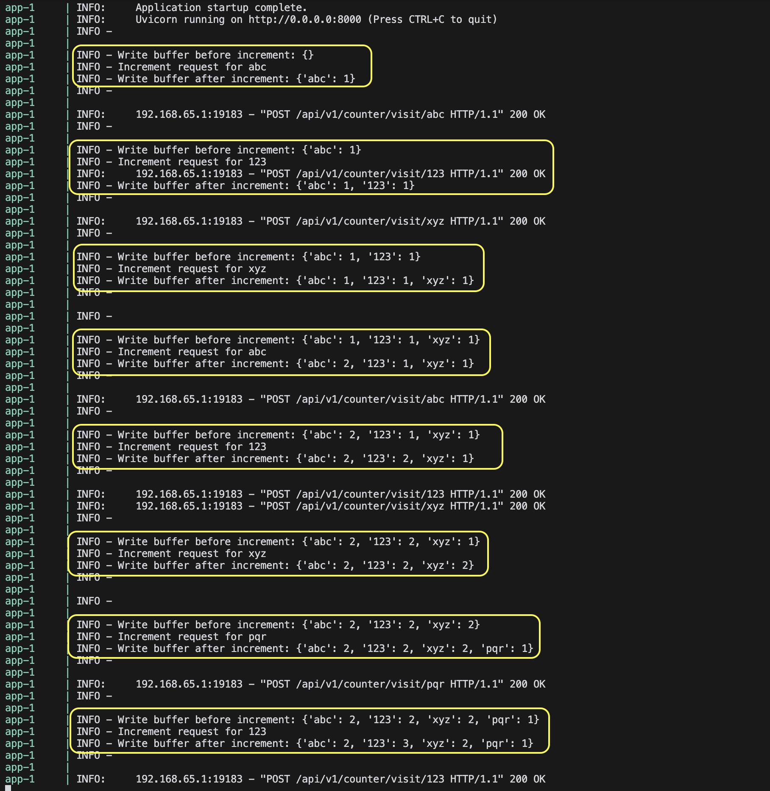
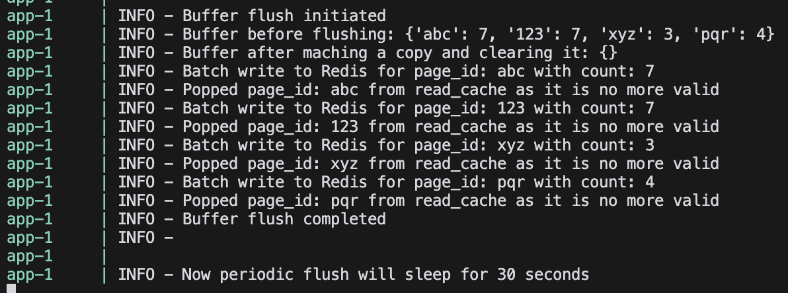
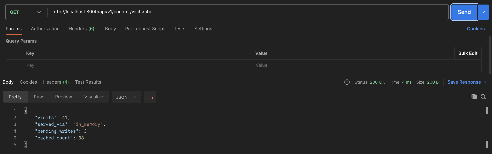
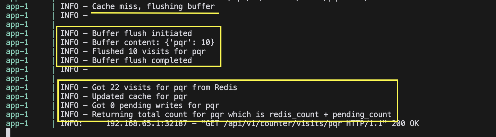

# Task 4: Batching Write Requests to Redis
- Use a python dictionary as a `write_buffer` to store new visit counts instead of writing directly to Redis.
- Implement a background process that flushes accumulated counts to Redis every 30
seconds.
- When serving read requests, combine the persisted count from Redis with the
pending counts in the memory buffer
- When serving read requests from Redis (cache miss), flush out the buffer as well.

### Testing Criteria:
- [X] Verify that new visits are correctly accumulated in the memory buffer.
- [X] Ensure the background flush process successfully updates Redis every 30 seconds.
- [X] Confirm that read requests return the correct total count (Redis + pending writes).

### `write_buffer` to store new visit counts

### Flush the buffer Every 30 sec

### Cache Hit --> `cached_count` + `pending_writes`

### Cache Miss
