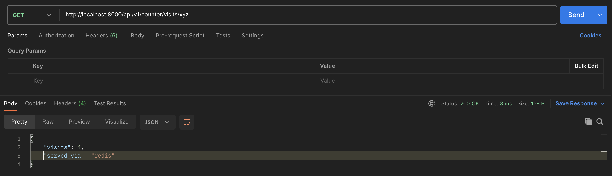
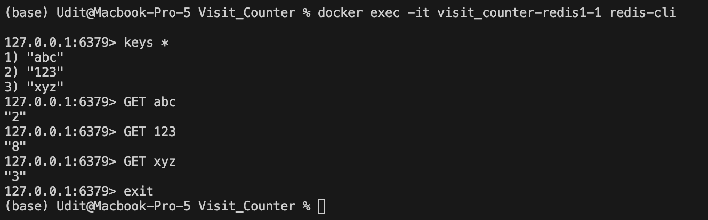
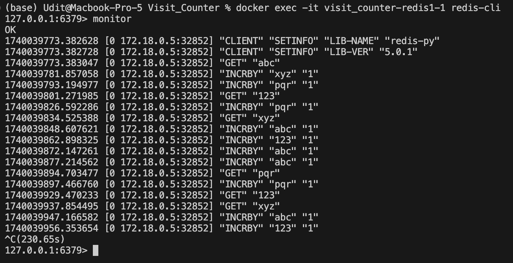
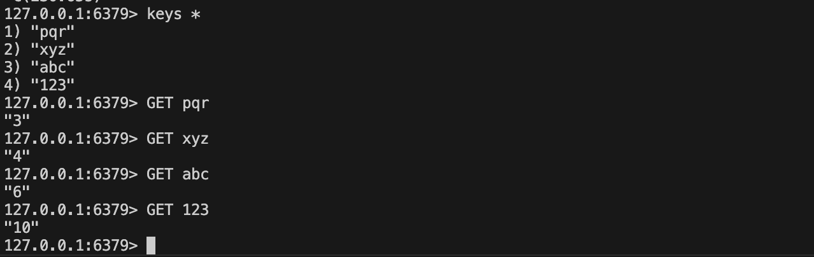

# Task 2: Counter Using Redis
- Implement RedisManager
- Currently, we have 3 instances of Redis. Connect to a single instance.
- Use `.incrby()` and `.get()` for write and read operations.
- Modify the response-type for Get Api.

#### Requirements:
- [X] Connect your backend API to Redis.
- [X] Store the visit counter as a Redis key-value pair.
- [X] Ensure that visit counts persist even after the application server restarts
- [X] The response of this endpoint should be: `{visits: [value], served_via: redis}`

### Testing Criteria:
- [X] Restart the application server and ensure the counter does not reset
- [X] Verify that the Redis cache correctly updates and retrieves the count.

## Get API response through redis:


## Before Server Restart: Check Redis Key-Value Pair


## Redis Logs After Server Restart


## After Restart: Verify Key-Value Pair in Redis


 ## Setup Instructions
 1. Make sure you have Docker and Docker Compose installed
 2. Make sure you are in the correct branch
 3. Run the application:
 ```
 docker compose up --build
 ```
 4. The API will be available at `http://localhost:8000`