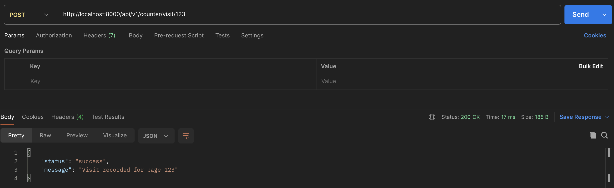

# Task 1: Basic Visit Counter
 - Use a Python dictionary as an in-memory variable.
 - The key will be `pageid`, and the value will be the `visit-count`.
 - Create a single instance of the `visit_counter_service`.
 - Modify the response-type for Get Api.

### API Endpoints Testing
 1. `POST /api/v1/counter/visit/{page_id}`: Record a visit


 2. `GET /api/v1/counter/visits/{page_id}`: Get visit count
 

 ## Setup Instructions
 1. Make sure you have Docker and Docker Compose installed
 2. Run the application:
 ```
 docker compose up --build
 ```
 3. The API will be available at `http://localhost:8000`

 ## Drawbacks
 Python dictionaries are not thread-safe, and race conditions can occur when multiple requests try to update the count of the same page_id at the same time.

 # Upgraded Task1: DefaultDict and Thread-Safety
- Use `DefaultDict` instead of a regular dictionary, as it automatically initializes missing keys to 0, making our code cleaner.
- I am applying locks on both read and write operations. This will make the system thread-safe.

### Drawbacks
- Since I am applying locks on both read and write operations, the system will be slower.
- To make the system faster, we need to decide based on our business use case whether to prioritize read or write operations.